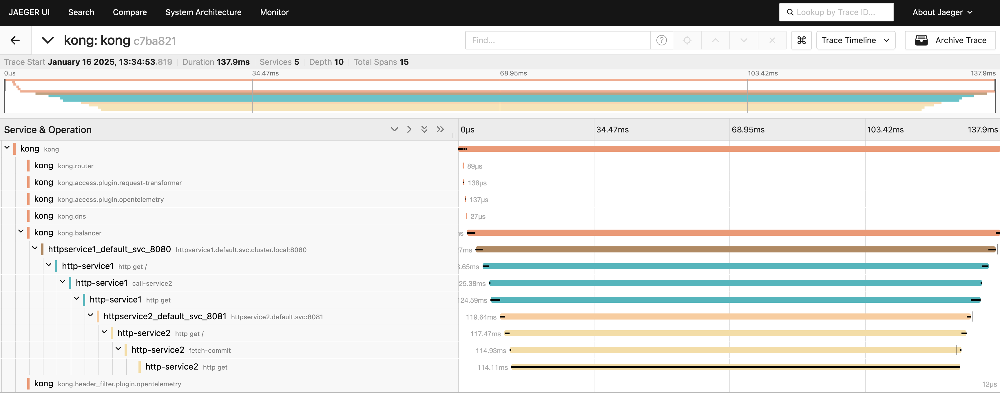

*_Forked from https://github.com/xsreality/spring-boot-tracing-demo_*


## Observability of HTTP services with Micrometer Tracing


### Building Application and Docker Images

Run below command to compile and build the docker images with Paketo buildpacks.

```shell
mvn spring-boot:build-image
```

### Run Docker Compose setup

Run below command to start Jaeger and the HTTP services.

```shell
docker-compose up
```

### Trigger a request to `httpservice1`.

```shell
curl http://localhost:8080
```

### View Traces in Jaeger

Open Jaeger at `http://localhost:16686` and check the traces.


